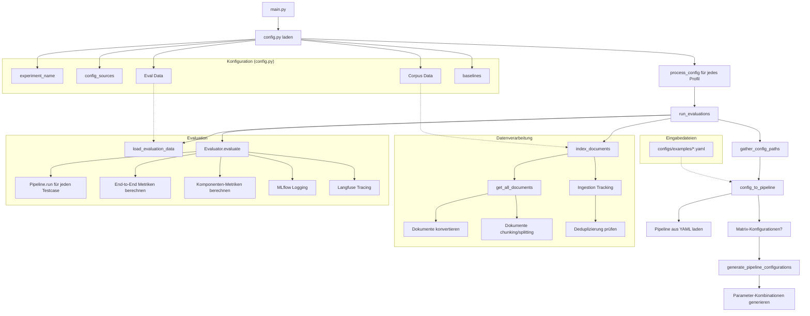

# Master's Thesis Project by Jan Albrecht

This repository contains all files for my master's thesis.

## Structure

### code/
- **code/analytics/**: Data preparation for the thesis
- **code/notebooks/**: Exploratory work for the framework
- **code/ragnroll_project/**: The developed framework
  - Further details can be found in [code/ragnroll_project/README.md](code/ragnroll_project/README.md)

## RAGnRoll Framework Overview

**RAGnRoll** - Der Hauptablauf:

### 1. **Konfiguration laden** (`config.py`)
- Experiment-Name, Datenpfade, Baselines-Einstellungen

### 2. **Pipeline-Konfigurationen sammeln**
- YAML-Dateien aus `config_sources` laden
- Bei Matrix-Konfigurationen: Alle Parameter-Kombinationen generieren

### 3. **Pipeline erstellen**
- YAML → Haystack AsyncPipeline Objekt

### 4. **Dokumente indexieren**
- Corpus-Daten laden und verarbeiten
- Dokumente konvertieren (PDF, TXT, etc.)
- Chunking/Splitting anwenden
- In Document Store laden (mit Deduplizierung)

### 5. **Evaluationsdaten laden**
- Testfälle aus JSON-Datei laden

### 6. **Evaluation ausführen**
- Für jeden Testcase: Pipeline.run()
- End-to-End Metriken berechnen
- Komponenten-Metriken berechnen (Retriever/Generator)

### 7. **Ergebnisse loggen**
- MLflow für Metriken und Parameter
- Langfuse für detaillierte Traces

Das Framework ist darauf ausgelegt, systematische Vergleiche verschiedener RAG-Konfigurationen zu ermöglichen.

### latex/
- Contains the master's thesis and related presentations

## Transparency Note

For full transparency, this framework includes all artifacts, MLflow parameters and metrics, as well as evaluation datasets and corpus data. The clean published version on GitHub has these in a separate branch.

The mlflow runs are also on github in the branch "abgabe-masterarbeit". 
If this is the unpacked zip file from the USB dongle, then those mlflow runs are already included.

Langfuse is not included.

For viewing the original mlflow runs in mlflow UI, please follow the instructions:

1. Download and Start Docker 
2. Open Terminal and move to /code/ragnroll_project/
3. copy .env.local to .env and set the correct values
4. run `docker compose up -d`
5. open http://localhost:8080/
    -> Make sure to select all experiments on the left sidebar and all runs in the table. Select then "Compare".

There are more runs than just the ones in the master's thesis, but all other runs are not reported in the thesis. Reasons for this are:
- Runs with errors 
- Runs that must be repeated due changes in the code
- Runs that got lost due disk overflow on VM (were also repeated)
