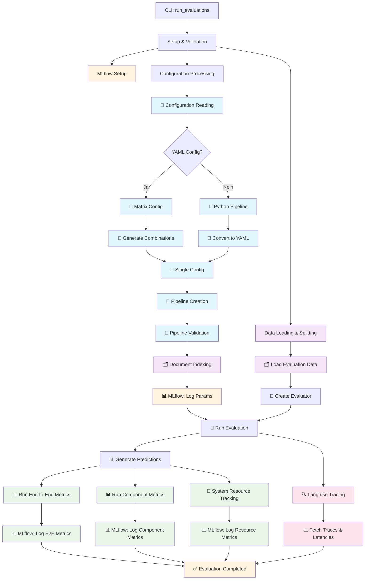

# Ragnroll Framework - Planungsdokumentation

## Übersicht des Frameworks (aktueller IST-Zustand)

Ragnroll ist ein modulares RAG (Retrieval-Augmented Generation) Evaluierungs-Framework, das systematische Benchmarking von RAG-Systemen ermöglicht. Das Framework verwendet MLflow für Metriken-Tracking, Langfuse für Tracing und bietet umfassende Validierung und Metriken-Analyse.

## Ausführungsflow in Mermaid (IST-Zustand)



## Aktueller IST-Zustand: Detaillierte Ausführungsphasen

### 1. Initialisierung & Setup
- **CLI-Kommando**: `run_evaluations` wird aufgerufen
- **Umgebung**: .env Variablen werden geladen (MLflow, Langfuse, API Keys)
- **MLflow Setup**: Tracking URI wird konfiguriert
- **Data Splitting**: Evaluationsdaten werden in Train/Val/Test aufgeteilt

### 2. Konfigurationsverarbeitung
- **YAML Konfigurationen**: Werden geladen und validiert
- **Matrix Configs**: Kombinatorische Parameter werden generiert
- **Python Pipelines**: Werden zu YAML konvertiert
- **Pipeline Validation**: Struktur und Komponenten werden validiert

### 3. Dokumenten-Indexierung
- **Corpus Processing**: Dokumente werden in den Document Store indexiert
- **Dauer-Tracking**: Indexierungszeit wird gemessen und geloggt

### 4. Evaluierungsausführung
- **Predictions**: Pipeline wird auf Testdaten ausgeführt
- **End-to-End Metriken**: Accuracy, Precision, Recall, F1-Score
- **Komponenten-Metriken**: Retriever- und Generator-spezifische Metriken
- **Resource Tracking**: CPU, Memory, Laufzeit-Monitoring

### 5. Tracing & Monitoring
- **Langfuse Integration**: Detaillierte Pipeline-Traces
- **Latency Analysis**: Komponenten-Latenzen werden analysiert
- **Score Posting**: Metriken werden zu Langfuse gesendet

### 6. Ergebnis-Aggregation
- **MLflow Logging**: Alle Parameter und Metriken werden gespeichert
- **DataFrame Export**: Ergebnisse werden strukturiert zurückgegeben
- **Visualisierung**: Pipelines können als PNG exportiert werden

## Aktuelle Framework-Komponenten

### Core Komponenten
1. **CLI Interface** (`ragnroll/cli.py`)
2. **Evaluator** (`ragnroll/evaluation/eval.py`)
3. **Metrics Registry** (`ragnroll/metrics/base.py`)
4. **Pipeline Management** (`ragnroll/utils/pipeline.py`)
5. **Tracing Integration** (`ragnroll/evaluation/tracing.py`)

### Metriken-System
- **End-to-End**: Klassifikationsmetriken (Accuracy, Precision, etc.)
- **Retriever**: Context Relevance, MAP@K
- **Generator**: Format Validation, Context Utilization, Answer Relevancy
- **System Resources**: CPU, Memory, Duration Tracking

### Validation Flow
```
Config Validation → Pipeline Validation → Data Validation → Execution → Results Validation
```

## Wichtige Dateien und Module

### Kernmodule:
- `ragnroll/cli.py` - CLI-Eingangspunkt
- `ragnroll/evaluation/eval.py` - Haupt-Evaluator
- `ragnroll/metrics/` - Metrik-Implementierungen
- `ragnroll/utils/pipeline.py` - Pipeline-Management

### Konfiguration:
- `configs/` - YAML-Konfigurationen
- `pipelines/` - Python-Pipeline-Definitionen

### Daten:
- `data/processed/` - Evaluationsdaten und Corpus
- `mlruns/` - MLflow Experiment-Daten

## Ausführungsbeispiel

```bash
python -m ragnroll run-evaluations \
    ./configs/examples/predefined.yaml \
    ./data/processed/dev_data/synthetic_rag_evaluation.json \
    ./data/processed/dev_data/corpus \
    --test-size 20
```

Dieser Befehl führt den kompletten Ausführungsablauf durch, inklusive aller Validierungen, MLflow-Logging und Langfuse-Tracing.

---

# Planungsbereich: Verbesserungen und Erweiterungen

## Identifizierte Verbesserungspotenziale

### 1. Metriken-Erweiterung
- **Erweiterte Komponenten-Metriken**: Weitere spezifische Metriken für verschiedene Retriever-Typen
- **Qualitative Metriken**: Metriken für Antwortqualität und Kohärenz
- **Custom Metric Integration**: Bessere Unterstützung für benutzerdefinierte Metriken

### 2. Tracing-Verbesserungen
- **Detailierte Debug-Informationen**: Erweiterte Tracing-Informationen für Fehleranalyse
- **Performance-Optimierung**: Effizientere Trace-Speicherung und Abfrage
- **Visualisierungs-Integration**: Bessere Integration mit Tracing-Tools

### 3. Konfigurationsmanagement
- **Validierungserweiterung**: Erweiterte Validierungsregeln für Konfigurationen
- **Template-System**: Wiederverwendbare Konfigurations-Templates
- **Versionierung**: Konfigurations-Versionierung und Migration

### 4. Benutzerfreundlichkeit
- **Dokumentation**: Erweiterte API-Dokumentation und Beispiele
- **Fehlermeldungen**: Verbesserte, verständliche Fehlermeldungen
- **CLI-Erweiterungen**: Zusätzliche CLI-Befehle für häufige Aufgaben

## Geplante Erweiterungen

### Phase 1: Metriken-Erweiterung
- [ ] Erweiterte Retriever-Metriken implementieren
- [ ] Qualitative Bewertungsmetriken hinzufügen
- [ ] Benutzerdefinierte Metriken-Schnittstelle verbessern

### Phase 2: Performance-Optimierung
- [ ] Tracing-Performance optimieren
- [ ] Pipeline-Ausführung beschleunigen
- [ ] Ressourcenverbrauch reduzieren

### Phase 3: Benutzererfahrung
- [ ] Verbesserte Dokumentation erstellen
- [ ] CLI-Befehle erweitern
- [ ] Beispiel-Projekte und Tutorials

### Phase 4: Erweiterte Funktionen
- [ ] Multi-Modalität unterstützen
- [ ] Streaming-Evaluierung ermöglichen
- [ ] Automatische Hyperparameter-Optimierung

## Technische Verbesserungen

### Code-Qualität
- [ ] Unit-Test-Abdeckung erhöhen
- [ ] Integrationstests erweitern
- [ ] Code-Refactoring für bessere Wartbarkeit

### Dokumentation
- [ ] API-Dokumentation automatisch generieren
- [ ] Tutorials für verschiedene Anwendungsfälle
- [ ] Best Practices dokumentieren

### Deployment
- [ ] Docker-Images optimieren
- [ ] CI/CD-Pipeline erweitern
- [ ] Monitoring-Integration verbessern

## Roadmap

### Q1 2025: Stabilität und Erweiterung
- Metriken-System erweitern
- Performance-Optimierungen
- Dokumentation verbessern

### Q2 2025: Benutzerfreundlichkeit
- CLI-Erweiterungen
- Beispiel-Projekte
- Tutorials erstellen

### Q3 2025: Erweiterte Funktionen
- Multi-Modalität
- Streaming-Evaluierung
- Automatisierte Optimierung

### Q4 2025: Produktionsreife
- Enterprise-Features
- Skalierbarkeit verbessern
- Community-Beiträge fördern
